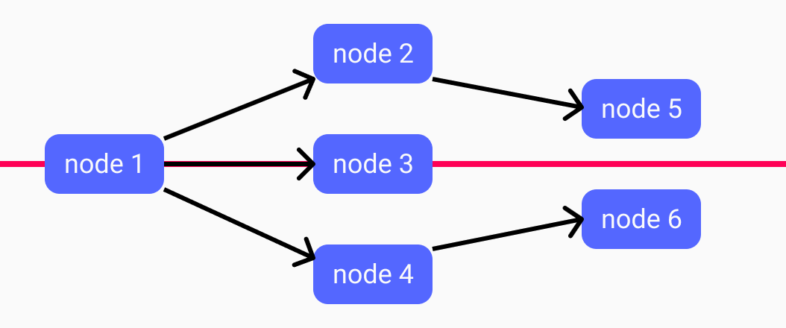

# DIGL: JavaScript Directed Graph auto-layout algorithm


[](https://www.npmjs.com/package/@crinkles/digl)
[](https://www.npmjs.com/package/@crinkles/digl)
[](https://www.npmjs.com/package/@crinkles/digl)
[](https://opensource.org/licenses/MIT)

A small JavaScript library that allows you to create visual layout of directed graphs (e.g. state machines), with minimum effort. The algorithm/heuristic is based on the workings of [GraphViz](https://www.graphviz.org/Documentation/TSE93.pdf).

## Getting started

You can configure a layout machine, by using the `layout` function with a configuration object. This returns a `function` that can be used to determine the positions of the based, based on a set of `nodes`, `edges`, and a starting node.

```js
import { layout } from '@crinkles/digl`;

const layoutMachine = layout({ width: 100, height: 50, orientation: 'vertical'});

const nodes = [{ id: '1' }, { '2' }];
const edges = [{ source: '1', target: '2' }];

const positionedNodes = layoutMachine('1', nodes, edges);
// [{ id: '1', x: 0, y: 0 }, { ... }]
```

## How it works

The algorithm used is based on the [GraphViz](https://www.graphviz.org/Documentation/TSE93.pdf), but a simplified version. It consists of several steps:

1. Place each node in a _rank_ from the starting point, where the starting node is 'rank 0'
2. Score the graph based on the initial ranks (e.g. based on the number of expected crossing edges)
3. Switch nodes within/between ranks, and see if we improve the score of the graph
4. If we improved the score, repeat step 3 for a maximum of X iterations, if we did not improve the score, we found a (local) optimum
5. Based on the final ranks, determine the positions of each node

A _rank_ is a list of nodes that can be accessed within X steps from the starting node (e.g. rank 1 means 1 step away from the start). Step 3 allows for different implementations (e.g. switching nodes row-based vs. column-based) to find the best (local) result.

### Determine the 'initial ranks'

Step one of the algorithm is to determine the initial ranks of the graph. This is achieved by combining several different techniques, and create an ordered list of ranks.

1. Use a _breadth-first search_ algorithm to determine the shortest possible route from the start node. The length of the found shortest route for each node is used as the corresponding _rank_ of the node.
2. Get all the paths based on the starting node, using a _depth-first search_ tree-traversal algorithm (note: it ignores already visited nodes within a path to avoid loops).
3. Order all nodes within a rank, based on its occurance in the longest paths, i.e. nodes in longer paths are placed higher in a rank compared to nodes in a shorter path. The resulting ranks are the initial ranks of the algorithm of this package.

```js
// get all paths DFS algorithm
function getAllPaths(nodeId, edges, path = [], paths = []) {
  const children = edges.filter((e) => e.source === nodeId);

  if (path.includes(nodeId) || !children || children.length === 0)
    paths.push([...path, nodeId]);
  else
    children.map((c) => getAllPaths(c.target, edges, [...path, nodeId], paths));

  return paths.sort();
}
```

### Score the graph based on its ranks

All 'ranks' can be scored with a number. The represents the number of visual crossing edges a graph based on the ranks will have, plus the amount of edges crossing over a node. Therefore, the lower the score, the better. The scores are determined by:

- Counting all edges that have a source and target within a single rank, which are not adjecent to each other in the rank.
- Go through all combinations of ranks, and:
  - Go through all combinations of ranks
  - Discard all edges that have a source and target within the same rank
  - Determine all edges, regardless of the direction, that have a source and target within these ranks
  - For combination of edges, determine if they cross

```js
// Note this is a part of the logic
let _score = 0;
if (e1.x > e2.x && e1.t < e2.t) _score++;
```

### Optimize the node order in each rank

Improving the ranks to find a local optimum is achieved with the following heuristic:

1. Copy `ranks` into `_ranks`;
2. Cycle through each rank of `_ranks` with index `i`;
3. Within `_rank[i]`, cycle through the nodes, with index `j`, except the last node;
4. Swap the values of `_rank[i][j]` and `_rank[i][j + 1]`;
5. Compare the score of the swapped situation with the non-swapped situation;
6. If the score _did not worsen_, apply the swapping to `_ranks`. Repeat step 1 or 2;
7. When finished, see of the score of `_ranks` is an improvement compared to the score of `ranks`;
8. If so, replace `ranks` with `_ranks` and repeat step 1 (for a maximum of 10 times). If not, return `ranks`.

### Determine the position of each node

Based on the resulting rank, all nodes are either vertically, or horizontally orientated, based on the configurattion. Nodes are positioned from top-to-bottom (or left-to-right in case of vertical orientation) as they are ordered in a rank. As visualized below, all nodes are centered around a middle line, to create a balanced tree-like graph. The space between two ranks is _2x the width/height_ in de configuration, based on the orientation (horizontal/vertical respectively). Similarly, the distance between two nodes within a rank, is _2x the height/width_ from the configuration.



> NOTE: in case you don't have fixed width/height for nodes, use an estimate in the configuration.
